# DataHuddle — Backend Reference

A map of everything behind the pages, written so you can redesign the front end
without having to read the back end.

**How to use this.** Part 1 is the shape of the whole thing — read it once. Parts
2 and 3 are the data. Part 4 is page-by-page: for any screen you want to rebuild,
that section tells you which function produces its numbers and exactly what comes
out. Part 5 is the draft simulator, which is the one genuinely complicated piece.
Part 6 is a set of recipes for extending things.

**The one rule that makes the rest make sense:** a page never touches a database,
a file, or a network. It calls a service, gets a DataFrame, and draws it. If you
want a number that does not exist yet, you are adding a service function — not
reaching further down from the page.

---

## Contents

1. [The shape of the system](#1-the-shape-of-the-system)
   - 1.1 [The five layers](#11-the-five-layers)
   - 1.2 [How a request flows](#12-how-a-request-flows)
   - 1.3 [AppContext — where everything is wired](#13-appcontext--where-everything-is-wired)
   - 1.4 [Caching, and what it costs](#14-caching-and-what-it-costs)
2. [The data layer](#2-the-data-layer)
   - 2.1 [Every source, at a glance](#21-every-source-at-a-glance)
   - 2.2 [What lives in MongoDB](#22-what-lives-in-mongodb)
   - 2.3 [What `load_data.py` actually does](#23-what-load_datapy-actually-does)
   - 2.4 [Column dictionaries](#24-column-dictionaries)
3. [Identity — how sources are joined](#3-identity--how-sources-are-joined)
   - 3.1 [The three id systems](#31-the-three-id-systems)
   - 3.2 [The resolution chain](#32-the-resolution-chain)
   - 3.3 [Known traps](#33-known-traps)
4. [Page by page](#4-page-by-page)
   - 4.1 [Season-long pages](#41-season-long-pages)
   - 4.2 [DFS pages](#42-dfs-pages)
   - 4.3 [Service reference table](#43-service-reference-table)
5. [The draft simulator, layer by layer](#5-the-draft-simulator-layer-by-layer)
6. [Extending things](#6-extending-things)
7. [Appendix: file map](#7-appendix-file-map)

---

# 1. The shape of the system

## 1.1 The five layers

About 30,000 lines of Python, in layers that only ever call downward.

| Layer | Folder | Job | May import |
|---|---|---|---|
| **Pages** | `pages/` | Streamlit scripts. Widgets and layout only. | services, presentation, `ui_helpers` |
| **Presentation** | `presentation/` | Turn a frame into a chart, a styled table, a column config. No data access. | `draft_model` constants, colours |
| **Services** | `services/` | Answer one question each. Return small tidy frames. | repositories, adapters, `draft_model` |
| **Repositories / Adapters** | `repositories/`, `adapters/` | Fetch raw data and cache it. Repos = one source; adapters = parse a messy file. | `db/`, network libraries |
| **Model** | `draft_model/` | Pure maths for the draft simulator. No Streamlit, no pandas in the hot paths, no I/O. | numpy only |

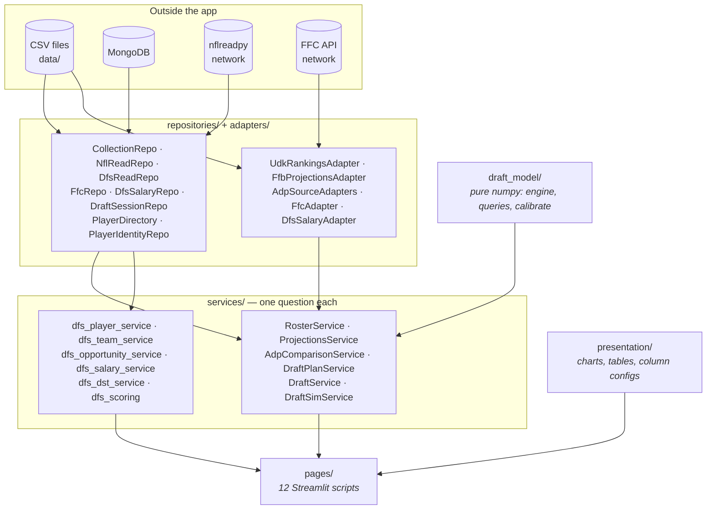

**Two halves of the app.** Season-long (Pre-Draft) and Daily Fantasy share the
identity layer and the scoring module, and almost nothing else. They even load
different seasons: `SEASONS = [2020…2025]` for game logs, `DFS_SEASONS =
[2023…2025]` because DFS reads play-by-play, which costs far more per season.

## 1.2 How a request flows

Every page follows the same five steps.

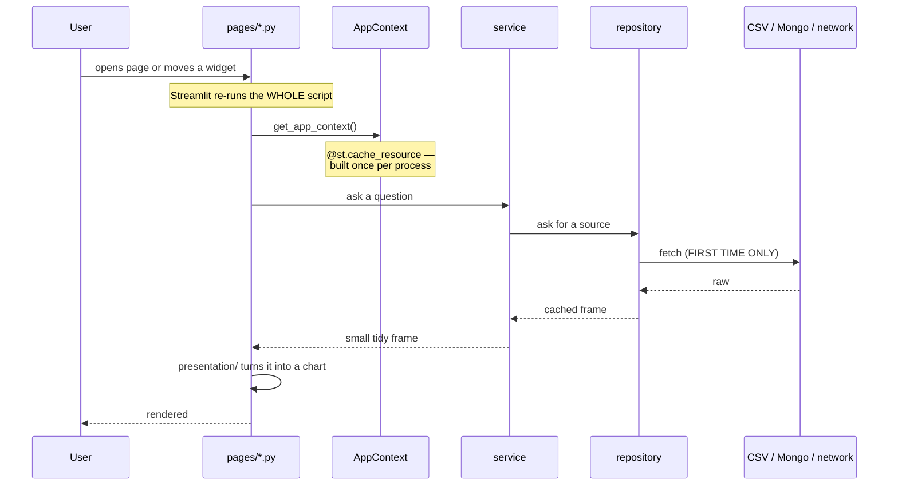

The thing to internalise: **the whole page script re-runs on every click.** That
is why repositories cache and why anything expensive sits behind
`@st.cache_data`. Your layout code will run hundreds of times; it must be cheap.

## 1.3 AppContext — where everything is wired

[`app_context.py`](../app_context.py) is the single place that decides which
concrete object is plugged into which. Everything else takes its collaborators as
arguments and never constructs them.

Pages reach it through `get_app_context()` from
[`streamlit_state.py`](../streamlit_state.py), which is wrapped in
`@st.cache_resource` — built once per process, shared by every page.

Twenty-one attributes hang off it:

```
ctx.nfl_read_repo        ctx.roster_service          ctx.draft_service
ctx.player_directory     ctx.projections_service     ctx.draft_plan_service
ctx.identity_repo        ctx.adp_comparison_service  ctx.draft_sim_service
ctx.udk_rankings_adapter ctx.player_markings_service ctx.ffc_repo
ctx.espn_adp_adapter     ctx.team_notes_service      ctx.ffc_service
ctx.yahoo_adp_adapter    ctx.ffb_adapter             ctx.dfs_read_repo
ctx.sleeper_adp_adapter  ctx.notes_transfer_service  ctx.dfs_salary_repo
```

**Building it is instant** (0.000s) — every repository loads lazily, so a page
that never asks for snap counts never waits for them.

## 1.4 Caching, and what it costs

Three tiers, and knowing which is which will save you a lot of confusion.

| Tier | Mechanism | Lives for | Used by |
|---|---|---|---|
| The context | `@st.cache_resource` | the process | `get_app_context()` |
| Raw sources | a dict on the repository | the process | every `*Repo` |
| Derived frames | `@st.cache_data` | keyed by arguments | expensive service calls in pages |

Measured costs worth knowing:

- `player_weeks()` (six sources joined, 3 seasons): **~15s cold, 0.1s warm**
- Play-by-play, 3 seasons: **56 MB** resident after pruning (372 MB/season raw)
- Everything the DFS pages load: **96 MB** total
- `offensive_tendencies()`: **0.03s** once pbp is warm
- A live draft re-simulation: **~190ms**

**A trap:** `@st.cache_data` hashes its arguments. Passing an unhashable object
(a repo, a DataFrame) fails unless the parameter name starts with an underscore.
That is why you see `_ctx`, `_state`, `_board` in
[`ui_helpers.py`](../ui_helpers.py).

---

# 2. The data layer

## 2.1 Every source, at a glance

| Source | Arrives as | Refresh | Covers | Used by |
|---|---|---|---|---|
| **UDK rankings** | 6 CSVs → Mongo | manual export | the player universe, tiers, risk/upside | everything season-long |
| **FFB projections** | 6 CSVs → Mongo | manual export | per-analyst stat projections | Projections, Draft Plan |
| **ESPN / Sleeper** | scraped CSVs → Mongo | `scripts/scrape_*.py` | ADP + projections | ADP Comparison, sim |
| **Yahoo** | saved HTML → CSV → Mongo | `scripts/parse_yahoo_*.py` | ADP | ADP Comparison, sim |
| **FFC** | live API → Mongo | `scripts/load_data.py` | ADP **and stdev** | the simulator |
| **nflreadpy** | network, in-memory | automatic | stats, pbp, rosters, schedules | game logs, all DFS |
| **DFS salaries** | 2 CSVs → Mongo | `scripts/load_salaries.py` | weekly prices | Cheat Sheet, DFS profile |
| **Your own data** | written by the app | — | drafts, plans, notes, sessions | Draft Manager, Runner |

**FFC is special.** It is the only source with `stdev` — how much a player's draft
position varies — and the simulator cannot run without it. ADP alone gives you a
centre with no spread.

## 2.2 What lives in MongoDB

25 collections, in four groups.

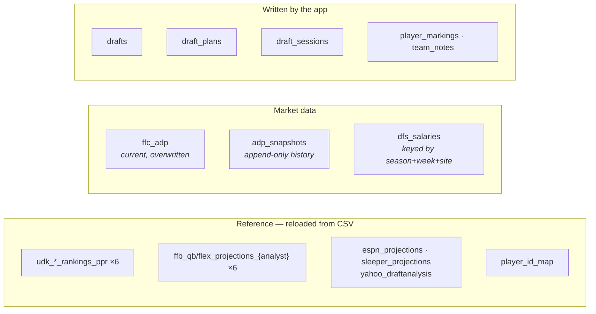

Three write patterns, and they matter if you build anything that writes:

- **Overwrite** — reference collections. `load_data.py` clears and reloads.
- **Append-only** — `adp_snapshots`. History you cannot recover if you skip a day.
- **Upsert by key** — `dfs_salaries` (season+week+site+site_player_id), `drafts`,
  `draft_sessions`. Reloading replaces that key and leaves everything else.

The database access API is [`db/documents.py`](../db/documents.py):
`find_one`, `find_all`, `upsert`, `delete`, `ensure_index`, `bulk_upsert`.

## 2.3 What `load_data.py` actually does

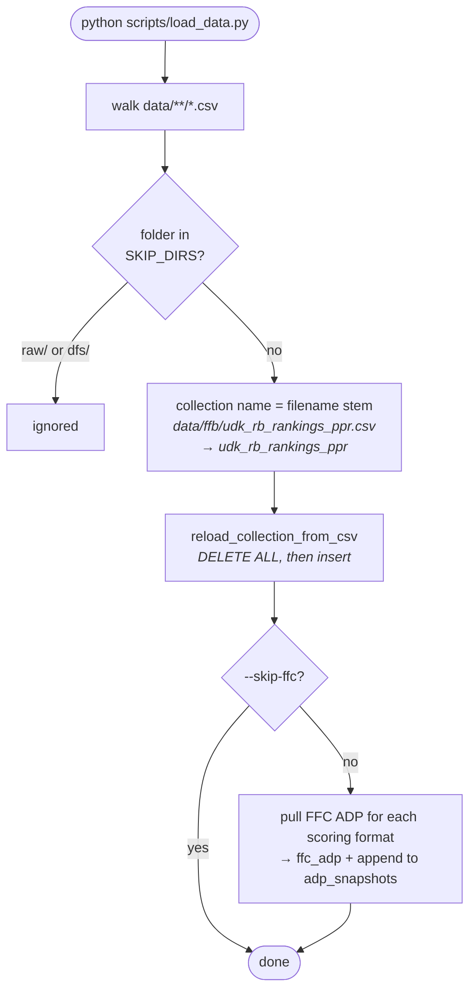

Three things to know:

1. **Filename is the collection name.** Adding `data/foo.csv` creates a `foo`
   collection with no code change.
2. **`data/raw/` and `data/dfs/` are skipped.** Raw holds scratch inputs; DFS
   salaries need real processing and have their own loader.
3. **It is destructive** for reference collections. A truncated CSV silently
   becomes a truncated collection — which is what
   [`scripts/check_data_files.py`](../scripts/check_data_files.py) exists to catch.

**Salaries are separate:** `python scripts/load_salaries.py` derives the week from
the DraftKings kickoff date, resolves names to player ids, reports what it could
not match, and upserts.

## 2.4 Column dictionaries

### UDK rankings — `udk_{qb,rb,wr,te,k,dst}_rankings_ppr`

The **player universe**. If somebody is not in these files, the season-long half
of the app does not know he exists.

| Column | Meaning |
|---|---|
| `Name`, `Position`, `Team`, `Bye Week` | identity |
| `Rank` | UDK's overall rank |
| `Points` | their projected season total |
| `Risk` | 0.5–9.5, higher = more volatile |
| `Upside` | 0.5–10, higher = bigger ceiling |
| `ADP` | their ADP |
| `Tier` | tier grouping within position |
| `Outlook`, `Dynasty`, `Markers` | free text |

⚠️ **Risk and Upside mostly restate the projection.** Measured within position,
upside correlates +0.93 with points at RB. The Draft Runner adjusts them
(`adjust_within_position` in `draft_model/queries.py`) so what remains is
genuinely new. Use the raw values only if you mean to.

### FFB projections — `ffb_{qb,flex}_projections_{andy,jason,mike}`

Two shapes. QB files: `Name, Team, Bye Week, Rank, PPG, YDS, TDS, YDS.1, TDS.1,
INT, FUM`. Flex files: `Name, Team, Bye Week, Pos, Rank, PPG, ATTS, YDS, TDS,
REC, YDS.1, TDS.1, FUM`.

The duplicated `YDS.1`/`TDS.1` are pandas disambiguating repeated headers — in QB
files the first pair is passing and the second rushing; in flex files the first
is rushing and the second receiving. `FfbProjectionsAdapter` renames them.

**Three analysts is the point.** Their disagreement is a signal —
`ProjectionsService.disagreement()`.

### ESPN / Sleeper — 23 and 22 columns

`name, team, position, half_ppr_adp, full_ppr_adp, projected_fantasy_points,
half_ppr_season, half_ppr_per_game, full_ppr_season, full_ppr_per_game`, then the
component stats (`pass_attempts` … `fumbles_lost`). Sleeper has no `targets`.

### Yahoo — `yahoo_rank, name, team, position, percent_drafted, preseason_adp, adp`

`percent_drafted` is how often he is taken at all — a useful signal the others
lack.

### FFC — `ffc_adp` / `adp_snapshots`

`ffc_player_id, name, position, team, adp, stdev, high, low, times_drafted, bye,
format, season, pulled_at`

**`stdev` is the reason this source exists.** Nothing else provides it.

### nflreadpy — loaded in memory, never stored

> **Full column listings for all 19 loaders — 1,188 columns — are in
> [NFLREADPY_COLUMNS.md](NFLREADPY_COLUMNS.md).** The table below is the summary;
> that document is the catalogue, grouped by theme, with the 44 play-by-play
> columns this app keeps marked in bold.

| Loader | Rows/season | Key | Carries |
|---|---|---|---|
| `load_player_stats` | ~19,000 | `player_id` (gsis) | box score + `target_share`, `air_yards_share`, `wopr`, `racr`, `pacr`, per-phase EPA |
| `load_pbp` | ~50,000 | — | every play; **372 MB raw, pruned to 44 columns → 19 MB** |
| `load_ff_opportunity` | ~6,000 | `player_id` | expected points, actual points, attempt counts. **Full PPR.** |
| `load_snap_counts` | ~27,000 | **`pfr_player_id`** | `offense_snaps`, `offense_pct` |
| `load_nextgen_stats` | ~1,500 | `player_gsis_id` | separation, cushion, aDOT, RYOE |
| `load_pfr_advstats` | ~4,500 | **`pfr_player_id`** | drops, yards before/after contact |
| `load_team_stats` | ~570 | `team` | `def_sacks`, `def_interceptions`, `def_tds`, … |
| `load_schedules` | ~285 | `game_id` | scores, `spread_line`, `total_line` |
| `load_teams` | ~36 | `team_abbr` | names, colours, logo URLs |

### DFS salaries — `dfs_salaries`

Both sites normalised to one shape by `adapters/dfs_salary_adapter.py`:

`site, season, week, site_player_id, name, canonical_id, position,
roster_positions, salary, team, opponent, game, site_projection, injury_status`

`canonical_id` is **nullable** — team defences never have one, and ~2% of names
do not resolve.

---

# 3. Identity — how sources are joined

The hardest problem in the app. Nine sources describe the same players and no two
agree on how to name them.

## 3.1 The three id systems

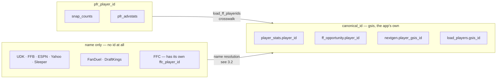

**`canonical_id` is nflreadpy's `gsis_id`** and looks like `00-0036900`. Every
service speaks it.

## 3.2 The resolution chain

Two different chains, because the two halves of the app faced the problem
separately.

**Season-long** — `PlayerIdentityRepo.resolve_many_with_fallback()`:

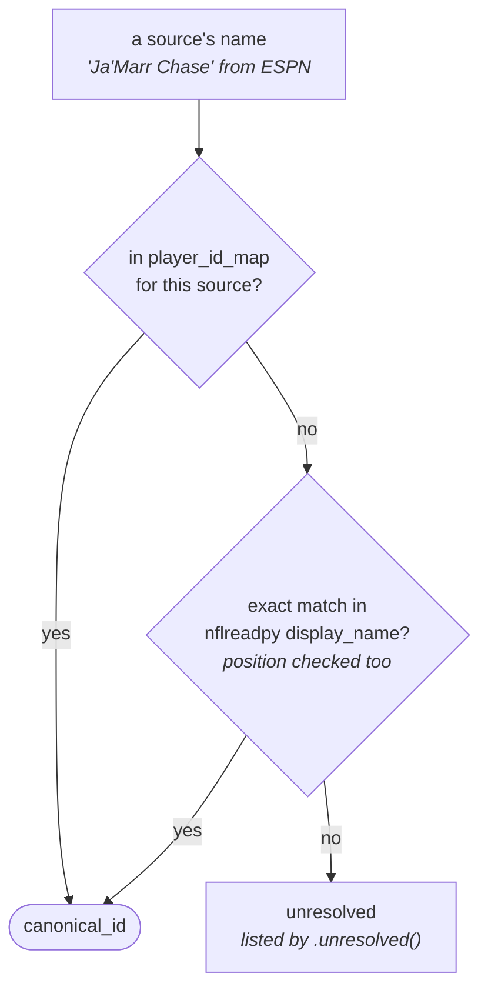

`player_id_map` is a **manual override table** (`source, source_name,
canonical_id`) — currently 16 rows, only the ones automation cannot get.

**DFS salaries** — a different chain, because site names are messier:

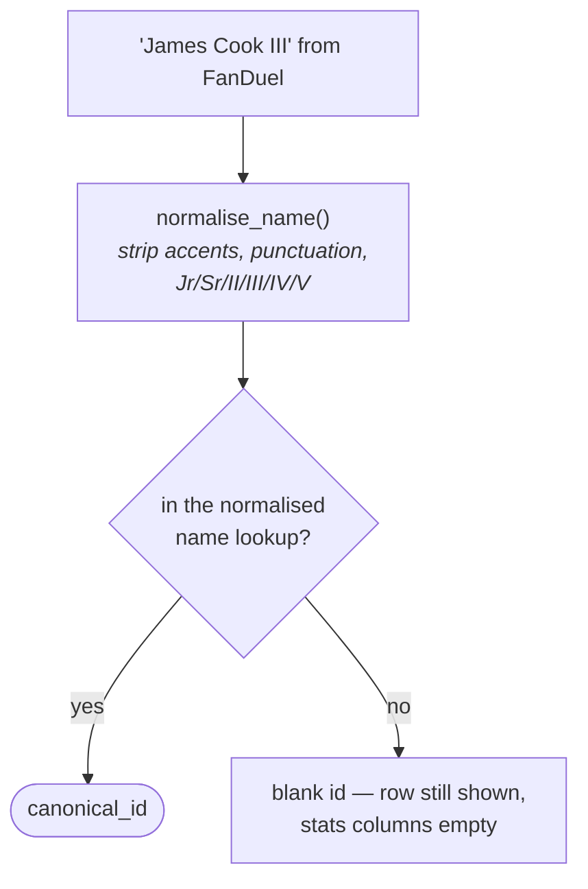

Measured: exact matching resolves **55%**; normalising takes it to **98%**.

## 3.3 Known traps

**Team defences never resolve.** They are not people. `canonical_id` is null and
`dfs_salaries` is keyed on the site's own id so they do not collide.

**PFR ids need a crosswalk**, from `load_ff_playerids`. Three PFR ids point at two
different players each and are dropped rather than guessed — a repeated key
multiplies rows on every join.

**Team abbreviations differ.** FanDuel writes `JAC`; nflreadpy says `JAX`.
Normalised in the adapter via `TEAM_ALIASES`. One unmapped abbreviation costs that
team every statistic on the page while still showing a plausible row.

**Non-skill players hide under skill positions.** Sites list fullbacks, tackles
and long snappers as RB/TE/WR because they are eligible receivers. Index every
position when building a name lookup, skill positions first so a shared name
resolves to the likely one.

---

# 4. Page by page

## 4.1 Season-long pages

### Draft Manager — `pages/draft_manager.py`

Create and edit leagues. The only page that is mostly writes.

| | |
|---|---|
| **Services** | `ctx.draft_service`, `ctx.notes_transfer_service`, `ctx.roster_service` |
| **Reads** | `drafts`, `player_markings`, `team_notes` |
| **Writes** | `drafts` — name, teams, draft position, rounds, platform, scoring, starting slots, keepers, third-round reversal. Also `player_markings` and `team_notes`, when copying between leagues. |
| **Key shapes** | a draft is a dict; keepers are `(team, round, canonical_id)` |

**Copying notes between leagues.** `NotesTransferService.preview(source, target)`
and `.copy(source, target)` are the same code with one flag, so a preview cannot
disagree with the outcome. Nothing is overwritten — tags are unioned and both
notes kept, labelled with the league each came from. Copying twice is a no-op,
and empty markings (the editor opened and saved without typing) are skipped.
Returns a `TransferReport` with per-row `Change` records and counts.

Everything else in the Pre-Draft half reads a draft from here.

### Player Profile — `pages/player_profile.py`

| | |
|---|---|
| **Services** | `ctx.roster_service`, `ctx.player_directory`, `ctx.player_markings_service` |
| **Data in** | `roster_service.player_names()` → `{canonical_id: name}`; `player_directory.get_gamelog(id)`; markings per draft |
| **Presentation** | `GameLogView.shape(gamelog, position)` — position-aware columns |

### Team Profile — `pages/team_profile.py`

`ctx.roster_service` + `ctx.team_notes_service`. Groups the roster by NFL team and
attaches your notes.

### ADP Comparison — `pages/adp_comparison.py`

| | |
|---|---|
| **Service** | `ctx.adp_comparison_service.compare(fmt)` |
| **Returns** | `canonical_id, display_name, headshot_url, position, espn_adp, yahoo_adp, sleeper_adp` — **307 rows** |
| **Presentation** | `AdpComparisonView` |

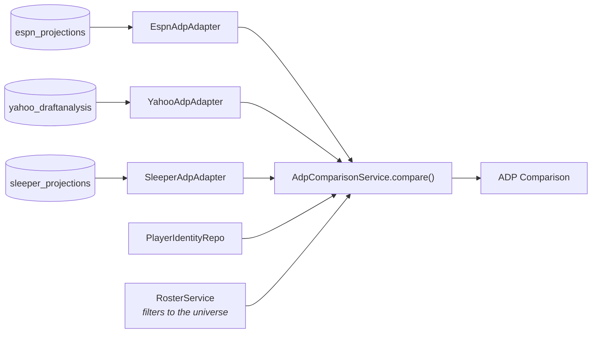

### Draft Plan — `pages/draft_plan.py`

Round-by-round targets.

| | |
|---|---|
| **Services** | `ctx.draft_plan_service`, `ctx.roster_service`, `ctx.projections_service`, `ctx.draft_sim_service` |
| **Reads/writes** | `draft_plans` collection |
| **Sim use** | `prob_any_available()` — the chance at least one of your targets survives |

⚠️ Known bug: `DraftPlanService.pick_labels` ignores third-round reversal, so pick
numbers are wrong in a 3RR league.

### Draft Runner — `pages/draft_runner.py`

The largest page (852 lines). Two modes (Live / Sim), three views (Board /
Console / Both).

| | |
|---|---|
| **Services** | `draft_runner_service` (module of functions, not a class), `DraftSessionRepo`, `DraftSimService` |
| **State** | `DraftState` — a pick log plus derived properties |
| **Re-simulation** | `cached_resim()` → `resimulate()` → `monte_carlo_sim`, ~190ms |

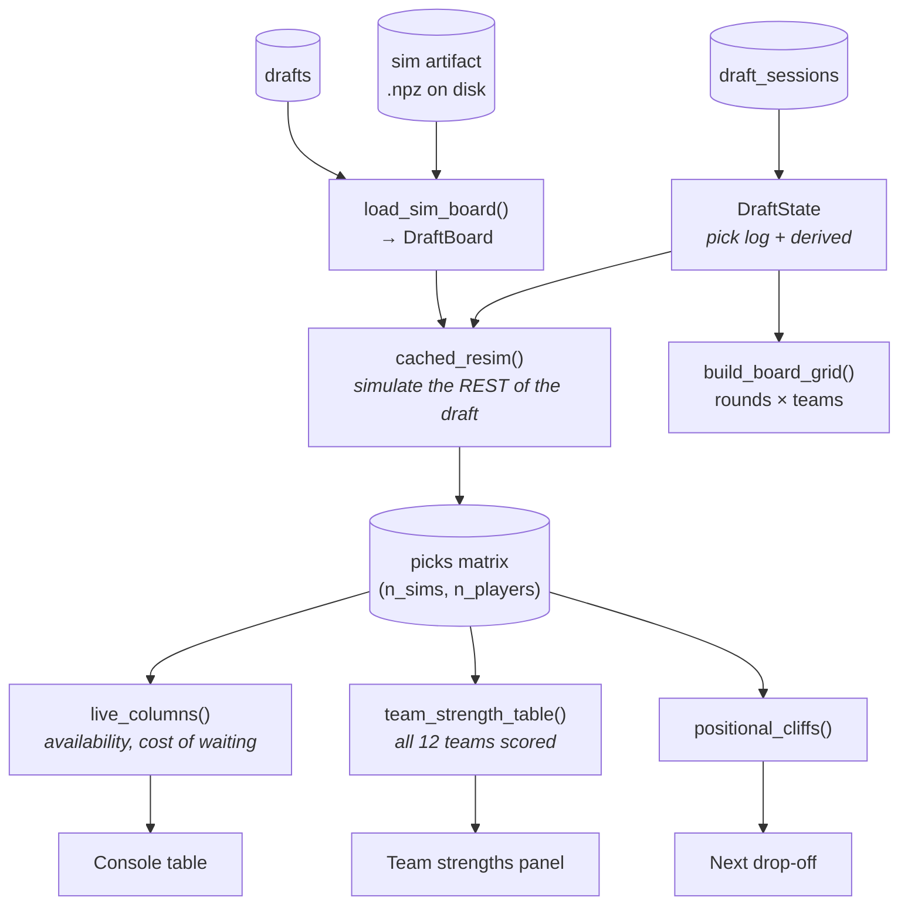

Key functions in `services/draft_runner_service.py`:

| Function | Gives you |
|---|---|
| `state_from_session(...)` | a `DraftState` from a stored session |
| `resimulate(state, board, n_sims)` | the picks matrix for the remaining draft |
| `live_columns(state, board, picks)` | the console table — availability per pick, cost of waiting |
| `team_strength_table(state, board, picks, projected, ratings)` | every team scored on 30 categories |
| `projected_roster(state, board, picks, team)` | `(n_sims, n_players)` bool — who a team ends up with |
| `positional_costs_for_team(...)` | cost of waiting, per position |
| `auto_pick`, `advance_until_your_turn` | Sim-mode automation |

### Sim Viewer — `pages/sim_viewer.py`

Inspect a stored simulation: one simulated draft board, availability curves,
calibration checks (`simulated_mean_pick`, `simulated_stdev_pick`).

## 4.2 DFS pages

All four share one data spine:

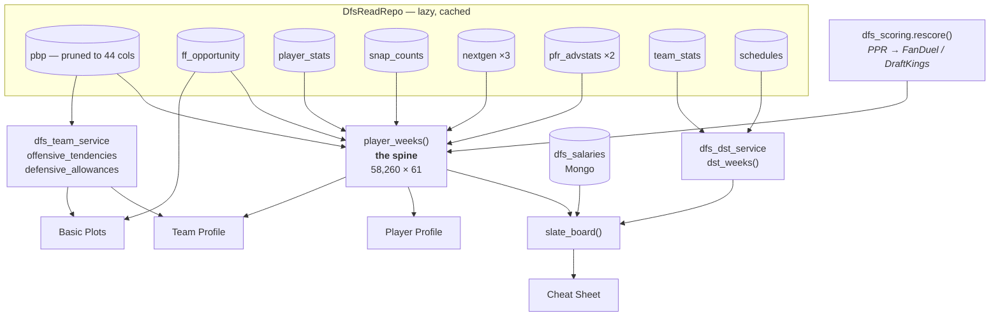

### `player_weeks()` — the spine

The single most important function in the DFS half. Over the three DFS seasons:
**58,260 rows × 61 columns, 31 MB — about 15s cold, 0.1s warm** (roughly 19,400
rows per season).

One row per player per week, with six sources joined. Column families:

| Family | Examples |
|---|---|
| Identity | `canonical_id, name, position, team, opponent, season, week, headshot_url` |
| Box score | `completions, attempts, passing_yards, carries, rushing_yards, receptions, targets, receiving_yards`, TDs |
| Shares | `target_share, air_yards_share, wopr, racr, pacr` |
| Efficiency | `passing_epa, rushing_epa, receiving_epa, passing_cpoe` |
| Expected | `total_fantasy_points`, `total_fantasy_points_exp`, and rush/rec/pass splits |
| Snaps | `offense_snaps, snap_share` |
| Tracking | `avg_separation, avg_cushion, avg_intended_air_yards, rush_yards_over_expected_per_att` |
| Charting | `receiving_drop_pct, rushing_yards_after_contact_avg` |
| Derived | `red_zone_touches, inside_5_carries` |

**Every join is a left join** from the box score outward. An inner join anywhere
would silently delete players. Blank means "this source does not cover him", not
zero.

### Basic Plots — `pages/dfs_basic_plots.py`

Fully data-driven: reads `presentation/dfs_plot_registry.py` and knows nothing
about any individual plot. See [DFS_BASIC_PLOTS.md](DFS_BASIC_PLOTS.md) for the
detailed map.

A `PlotSpec` declares `label, question, filters, build, chart, renderer,
uses_scoring, chart_filters, shared_filters, reading, default_positions`. Filters
route three ways — build-only, chart-only, shared.

### DFS Player Profile — `pages/dfs_player_profile.py`

`player_weeks()` → `rolling_form()` for the strip → `tabs_for(position)` and
`shape()` for five game-log tabs → salary block from `dfs_salary_repo`.

### DFS Team Profile — `pages/dfs_team_profile.py`

Two tabs. Offence: `offensive_tendencies` + `league_ranks` + `implied_totals` +
`team_usage` + `weekly_tendencies`. Defence: `defensive_allowances` + ranks.

### Cheat Sheet — `pages/dfs_cheat_sheet.py`

**Two modes**, decided by whether salaries exist for the week:

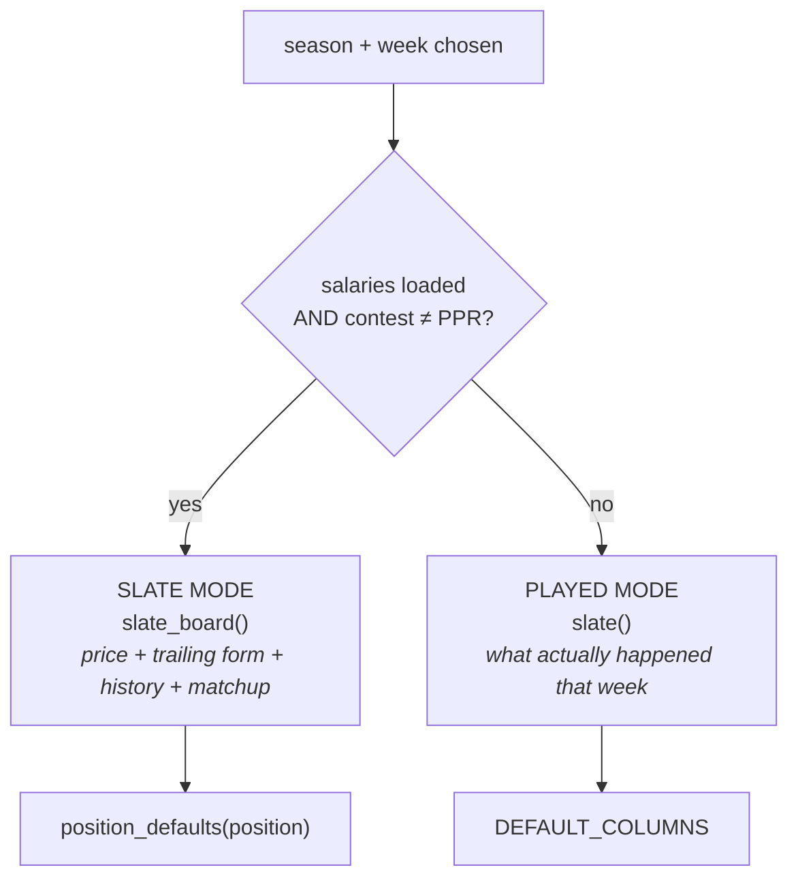

One position at a time — QB, RB, WR, TE, FLX, DST — each with its own default
column set from a catalogue of 72.

## 4.3 Service reference table

| Service | Entry point | Returns | Rows |
|---|---|---|---|
| RosterService | `.roster()` | `canonical_id, display_name, headshot_url, position, team, bye_week, rank, points, risk, upside, adp, tier` | 307 |
| | `.player_names()` | `{canonical_id: name}` | |
| AdpComparisonService | `.compare(fmt)` | `canonical_id, display_name, position, espn_adp, yahoo_adp, sleeper_adp` | 307 |
| ProjectionsService | `.get_own_projections(analyst)` | 32 cols incl. `fantasy_points_{fmt}_season/per_game`, `_low/_high/_spread` | 307 |
| | `.disagreement(fmt)` | per-player analyst spread | |
| FfcService | `.with_canonical_id(fmt)` | FFC ADP + **stdev** + `canonical_id` | 204 |
| NotesTransferService | `.preview(src, tgt, label, names)` | `TransferReport` — what a copy would do, writes nothing | |
| | `.copy(src, tgt, label, names)` | the same, applied | |
| DraftSimService | `.build_model_table(config)` | the sim's player table | ~250 |
| | `.artifact_for(draft_id, config)` | path to the `.npz` | |
| dfs_player_service | `player_weeks(repo, scoring)` | the spine | 58,260 |
| | `team_usage(frame, team, …)` | per-player shares | ~30 |
| | `slate(frame, season, week, …)` | one played week | ~300 |

*Row counts are for the seasons currently loaded — three for DFS, six for
season-long. Divide by the season count for a per-season figure.*
| dfs_team_service | `offensive_tendencies(repo, season, weeks)` | pace, pass rate, PROE, RZ | 32 |
| | `defensive_allowances(repo, …, play_kind)` | EPA + FP allowed | 32 |
| | `league_ranks(table, cols, lower_is_better)` | adds `<col>_rank` | |
| dfs_opportunity_service | `actual_vs_expected(repo, …)` | per-player actual vs expected | ~380 |
| dfs_salary_service | `slate_board(salaries, pw, …)` | prices + form + history + matchup | ~700 |
| | `trailing_form(pw, season, week, games)` | every numeric column averaged | |
| dfs_dst_service | `dst_weeks(repo)` | scored team defences | 1,710 |
| dfs_scoring | `rescore(frame, scoring)` | restated points | |

---

# 5. The draft simulator, layer by layer

The one genuinely complicated part. It is **pure numpy** — no pandas in the hot
paths, no Streamlit, no I/O — which is what makes 10,000 simulated drafts
feasible.

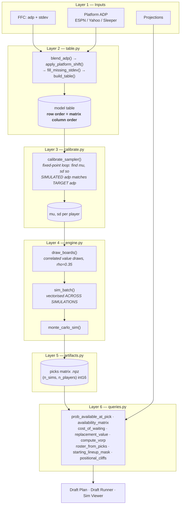

### Layer 1 — inputs

FFC provides `adp` **and `stdev`**; platforms provide their own ADP. `stdev` is
the only reason FFC is here.

### Layer 2 — the model table (`table.py`)

Four steps: `blend_adp` (weights renormalised **per player**, so a player in only
one source gets that source's ADP undiluted) → `apply_platform_shift` (nudge FFC
toward your platform, `PLATFORM_WEIGHT = 0.5`) → `fill_missing_stdev` → `build_table`.

⚠️ **The table's row order defines the picks-matrix column order.** There is
exactly one sort, in `build_table`, on `adp_target`. Re-sorting the table
elsewhere silently misaligns every result. `matches_table()` guards this and sets
`DraftBoard.stale`.

### Layer 3 — calibration (`calibrate.py`)

The subtle bit. You want simulated ADP to match real ADP, but a player's *drawn*
value is not his ADP — positional need pushes players around. So a fixed-point
loop adjusts `mu` and `sd` until the simulation reproduces the targets.
`validate_sim()` checks the result within tolerance.

### Layer 4 — the engine (`engine.py`)

**Vectorised across simulations, not across picks.** Picks are inherently
sequential; simulations are independent. So the inner loop walks picks once while
operating on all 10,000 simulations at a time.

`draw_boards` gives each simulated manager an opinion of every player, correlated
at `RHO = 0.35` — managers partly agree, which is what makes runs happen.

Behaviour constants in `config.py`:

| Constant | Value | Effect |
|---|---|---|
| `RHO` | 0.35 | how much managers agree |
| `ALPHA` | 0.7 | value-vs-need weighting |
| `NEED_BONUS` | 15.0 | boost for an unfilled starting slot |
| `BLOCK` | 10,000 | effectively forbids a pick |
| `HARD_LIMIT` | QB 2, RB 6, WR 6, TE 2, K 1, DST 1 | roster caps |
| `STARTER_DEADLINE` | QB 100, RB 60, WR 60, TE 100 | when need starts to bite |
| `UNDRAFTED` | 999 | sentinel in the picks matrix |

### Layer 5 — artifacts (`artifacts.py`)

Simulation is **offline** — `scripts/run_draft_sim.py` writes an `.npz`; the app
only reads it. A `SimArtifact` holds `picks`, `player_ids`, `config`, `mu`, `sd`,
`metadata`.

### Layer 6 — queries (`queries.py`, 1,115 lines)

Everything reads the same picks matrix. **This is where you will spend your time
if you add a draft feature.**

| Function | Answers |
|---|---|
| `prob_available_at_pick(picks, i, pick)` | will he last? |
| `availability_matrix(picks, targets)` | the same for many picks at once |
| `prob_any_available(picks, idxs, pick)` | will *at least one* of these last? |
| `replacement_value(...)` / `compute_vorp(...)` | value over replacement |
| `cost_of_waiting(...)` | what skipping him costs |
| `positional_cliffs(positions, projections)` | how many are left before value falls away |
| `roster_from_picks(picks, owned)` | who a team ends up with, per simulation |
| `starting_lineup_mask(...)` / `lineup_points(...)` | slot a roster, score it |
| `adjust_within_position(...)` | strip the projection out of a rating |

**Joint questions are why the matrix is kept.** "Will at least one of these three
survive?" cannot be reconstructed from per-player probabilities.

---

# 6. Extending things

### Add a column to an existing page

If it already exists in the frame, add it to the presentation config. For the
Cheat Sheet that is one `Column(...)` in `presentation/dfs_cheatsheet.py`.

### Add a new statistic

1. Is it in a source already loaded? → derive it in the relevant service.
2. New nflreadpy loader? → add a lazy getter to `DfsReadRepo`.
3. New pbp column? → add it to `PBP_COLUMNS` (the data reloads; that is expected).

### Add a plot to Basic Plots

Write a build function in `services/`, a chart function in
`presentation/dfs_charts.py`, add one `PlotSpec`. The page changes only if the
filter type is new.

### Add a whole page

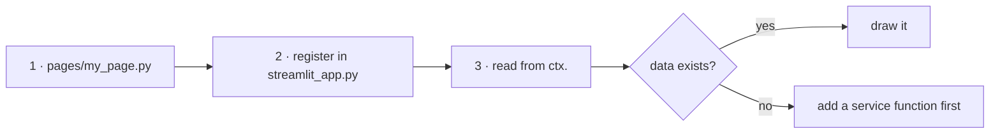

### Redesign a page's layout

The safest change in the codebase. Pages hold no data logic. Keep the service
calls, replace everything below them. Two rules:

- Anything expensive goes behind `@st.cache_data` (underscore-prefix unhashable args).
- `st.segmented_control` needs `required=True`, or clicking the active option
  returns `None` and your page blanks.

### Things that will bite you

| Trap | What happens |
|---|---|
| `st.altair_chart` default theme | Streamlit restyles your chart. Pass `theme=None`. |
| Multi-dataset Altair layers | Streamlit sends **one** dataset; other layers silently draw nothing. |
| Re-sorting the model table | Silently misaligns every simulation result. |
| Fraction vs percentage | `snap_share` is 0–1; `aggressiveness` is already 0–100. |
| `.fillna(0)` on a DFS frame | Raises — arrow string columns reject a numeric fill. Fill per column. |
| `str()` on a scoring enum | Python 3.11+ gives `DfsScoring.FANDUEL` unless `__str__` is set. |

---

# 7. Appendix: file map

```
app_context.py          composition root — everything wired here
streamlit_app.py        entry point, navigation
streamlit_state.py      get_app_context(), SEASONS, DFS_SEASONS
registry.py             Mongo collection names, marking categories
scoring.py              ScoringFormat, fantasy_points()
ui_helpers.py           shared page glue: draft_selector, load_sim_board, cached_resim

adapters/       parse messy sources        6 files, 1,199 lines
repositories/   fetch + cache one source  10 files, 2,429 lines
services/       answer one question       17 files, 6,001 lines
draft_model/    pure-numpy simulator       9 files, 3,810 lines
presentation/   frames → visuals          15 files, 2,613 lines
pages/          Streamlit scripts         12 files, 3,513 lines
db/             Mongo access               5 files,   414 lines
scripts/        offline jobs               8 files, 1,878 lines
tests/          615 tests, ~4s, offline   36 files, 7,978 lines
```

**Other documents:**

| Document | What it covers |
|---|---|
| [NFLREADPY_COLUMNS.md](NFLREADPY_COLUMNS.md) | Every column of all 19 nflreadpy loaders, grouped |
| [`draft_model/DESIGN.md`](../draft_model/DESIGN.md) | The simulator's rationale and invariants |
| [DFS_BASIC_PLOTS.md](DFS_BASIC_PLOTS.md) | The plot registry, in detail |
| [DFS_PLAN.md](DFS_PLAN.md) | How the DFS half was designed and phased |
| [DRAFT_RUNNER_ADVANCED.md](DRAFT_RUNNER_ADVANCED.md) | Cliff finder, team strengths, risk/upside |

**Running things:**

```bash
streamlit run streamlit_app.py      # the app
pytest                              # 615 tests, ~4s, no network or database
python scripts/load_data.py         # reload reference collections + FFC
python scripts/load_salaries.py     # weekly DFS salaries
python scripts/run_draft_sim.py     # generate a simulation artifact
python scripts/check_data_files.py  # validate CSVs before loading
```
