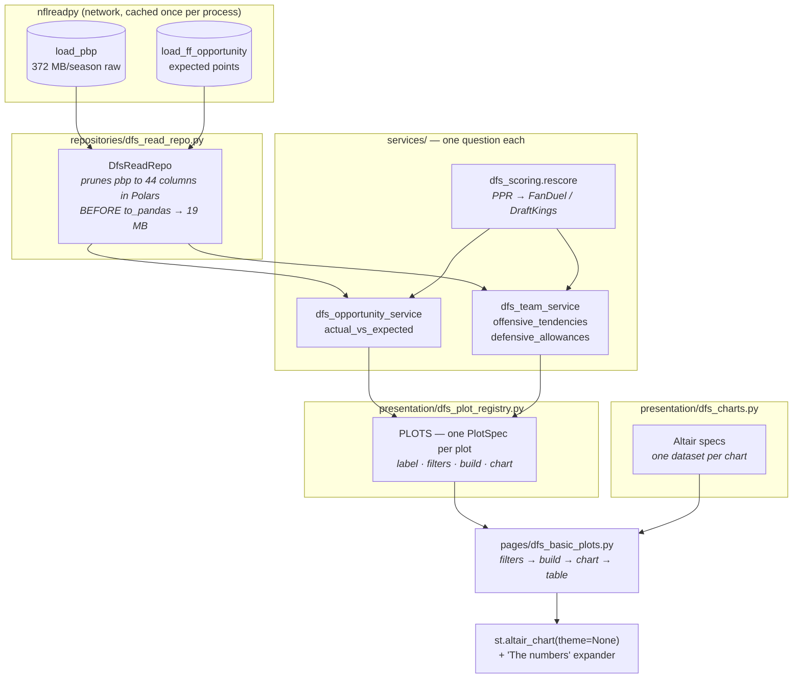
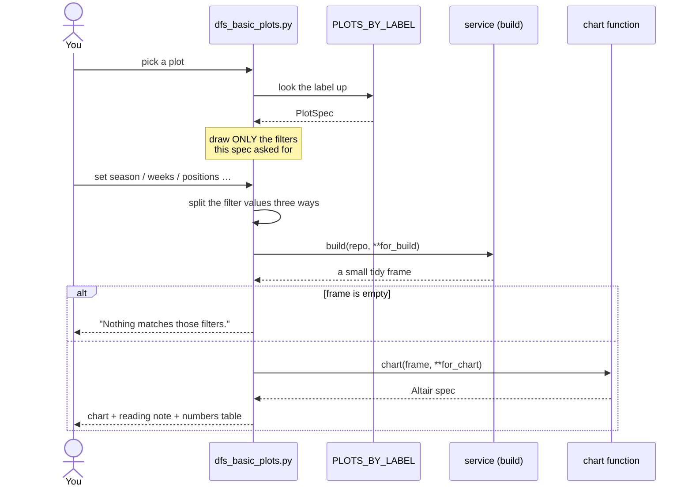
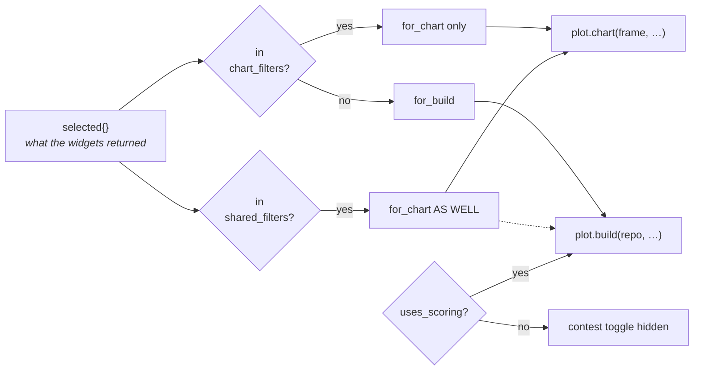
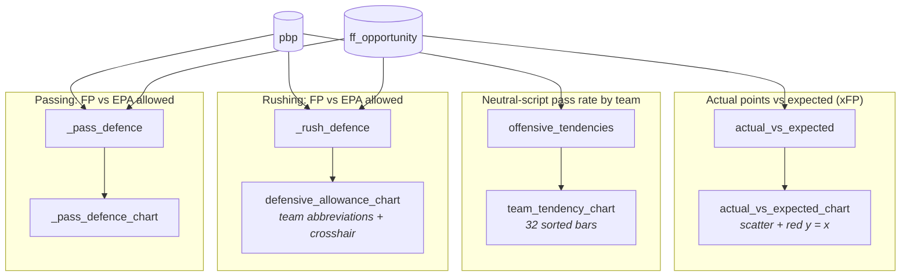
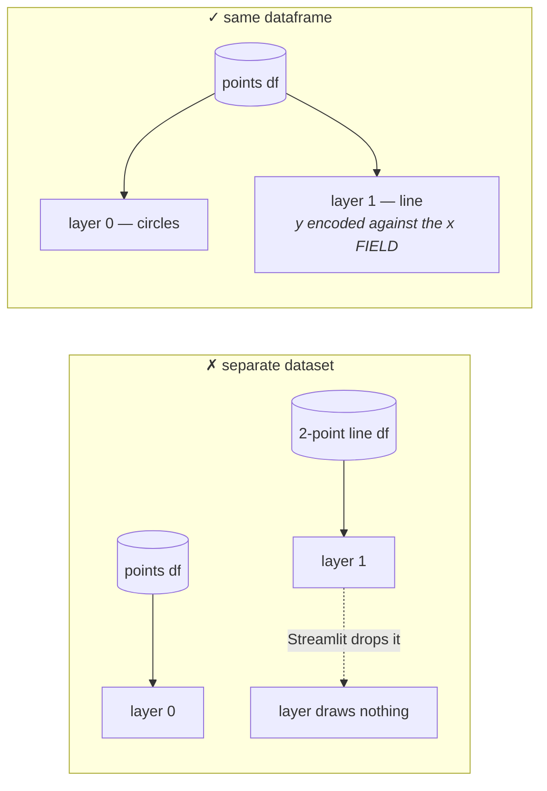
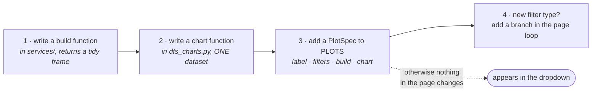

# Basic Plots — how the page is wired

A map of [pages/dfs_basic_plots.py](../pages/dfs_basic_plots.py) and everything
behind it, for the next time somebody adds a plot.

**The page knows about no particular plot.** It reads
[presentation/dfs_plot_registry.py](../presentation/dfs_plot_registry.py), draws
the filters each entry asks for, calls that entry's builder and chart, and
renders whatever comes back. Adding a plot is one entry in `PLOTS`; the page
itself never changes.

---

## The whole path

---

## What the reader does, and what happens

---

## The filter routing

The one part of the page with real logic. A filter names either the DATA to
fetch, the way to DRAW it, or both.

`split` is the reason `shared_filters` exists: the builder uses it to pick which
columns to read, and the chart uses it to title the axes.

`uses_scoring` is false for the pass-rate plot — a pass rate is the same number
whatever a catch pays, so offering the choice would imply otherwise.

**Both routes are tested.** `test_every_filter_reaches_the_function_that_accepts_it`
in [tests/test_dfs_opportunity.py](../tests/test_dfs_opportunity.py) checks every
declared filter against the signature of the function it is routed to — a
mis-route otherwise raises an unexpected-keyword error only at click time.

---

## The four plots

| Plot | Filters | Scoring? | Sources |
|---|---|---|---|
| Actual vs xFP | season, weeks, positions, split, min games | yes | `ff_opportunity` |
| Neutral pass rate | season, weeks, measure | **no** | `pbp` |
| Rushing defence | season, weeks, positions | yes | `pbp` + `ff_opportunity` |
| Passing defence | season, weeks, positions | yes | `pbp` + `ff_opportunity` |

The two defence plots are the same function with `play_kind` fixed, wrapped so
the registry stays declarative rather than carrying partials.

---

## Two rules that fail silently if broken

### One dataset per chart

Streamlit sends exactly **one** dataset to the browser per chart, whatever the
chart thinks it has. A reference line built from its own little table is dropped
on the way out, and the layer is left pointing at a dataset name that no longer
exists — no error, nothing drawn.

A `y = x` line needs no data of its own: encode the y channel against the x
field and every row contributes a point on the diagonal. Written up as
`EVERY_LAYER_SHARES_THE_DATA` at the top of
[presentation/dfs_charts.py](../presentation/dfs_charts.py).

### `theme=None`

`st.altair_chart` defaults to `theme="streamlit"`, which restyles the chart —
and controlling colour exactly is the only reason these pages use Altair rather
than `st.scatter_chart`.

---

## Adding a plot

Steps 1–3 are the normal case. Step 4 is only needed for a filter the page has
never drawn before; the existing six — `season`, `weeks`, `positions`, `split`,
`measure`, `minimum_games` — already cover a lot.
